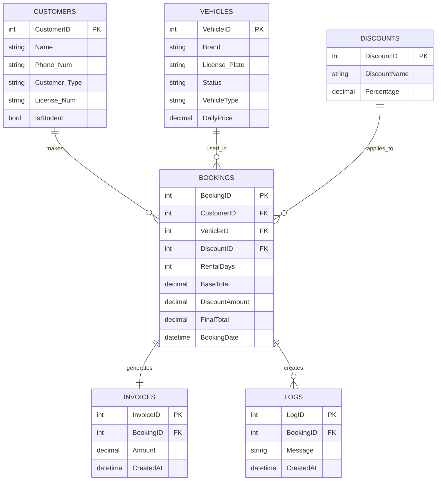

# Car Rental ERD

```mermaid
erDiagram
    CUSTOMERS ||--o{ BOOKINGS : makes
    VEHICLES ||--o{ BOOKINGS : used_in
    DISCOUNTS ||--o{ BOOKINGS : applies_to
    BOOKINGS ||--|| INVOICES : generates
    BOOKINGS ||--o{ LOGS : creates

    CUSTOMERS {
        int CustomerID PK
        string Name
        string Phone_Num
        string Customer_Type
        string License_Num
        bool IsStudent
    }

    VEHICLES {
        int VehicleID PK
        string Brand
        string License_Plate
        string Status
        string VehicleType
        decimal DailyPrice
    }

    BOOKINGS {
        int BookingID PK
        int CustomerID FK
        int VehicleID FK
        int DiscountID FK
        int RentalDays
        decimal BaseTotal
        decimal DiscountAmount
        decimal FinalTotal
        datetime BookingDate
    }

    DISCOUNTS {
        int DiscountID PK
        string DiscountName
        decimal Percentage
    }

    INVOICES {
        int InvoiceID PK
        int BookingID FK
        decimal Amount
        datetime CreatedAt
    }

    LOGS {
        int LogID PK
        int BookingID FK
        string Message
        datetime CreatedAt
    }
```
